<!--
 * @Author: wyiwei1 wyiwei@seas.upenn.edu
 * @Date: 2025-03-25 21:15:56
 * @LastEditors: wyiwei1 wyiwei@seas.upenn.edu
 * @LastEditTime: 2025-04-30 12:05:12
 * @FilePath: \final-project-t11-keep-real\A14G_README.md
 * @Description: 这是默认设置,请设置`customMade`, 打开koroFileHeader查看配置 进行设置: https://github.com/OBKoro1/koro1FileHeader/wiki/%E9%85%8D%E7%BD%AE
-->
# A14G Final Submission

```
Team Number: 11
Team Name: Keep Real
Team Members: Binsheng Zhang, Yiwei Wang
GitHub Repository URL: https://github.com/ese5160/a14g-final-submission-s25-t11-keep-real.git
Description of test hardware: Win11 Desktop, SAMW25 Custom board
```

# 1. Video Presentation

[](https://www.youtube.com/watch?v=N6gD0Xxki0o)

# 2. Project Summary

## 2.1 Device Description

Our project is an intelligent smart lock that offers multiple unlocking methods, including password entry, fingerprint recognition, cloud-based password unlocking, and cloud-based button unlocking.
Additional features include password management, fingerprint enrollment and deletion, air quality monitoring, and alarm triggering, making it suitable for apartment doors, home entry systems, and even secure safes.

### What inspired you to do the project? What problem is your device solving?

We were inspired by the growing demand for secure and flexible access control in modern living environments.
Our device addresses the limitations of traditional locks by offering multi-factor authentication options and real-time remote control, enhancing both security and user convenience.

### How do you use the Internet to augment your device functionality?

Through Internet connectivity, our device enables remote access to air quality data, instant alerts for unauthorized unlocking attempts, and seamless remote unlocking via wireless communication.
Additionally, a cloud-based keypad interface allows users to control all device functionalities wirelessly, offering full remote management and enhanced security.

## 2.2 Device Functionality

The entire system is built around the SAMW25 chip as the central computing core, running FreeRTOS as the real-time operating system. Peripheral components include a servo motor, air quality sensor, LCD display, keypad, fingerprint sensor, buzzer, and an Arduino board.

### 2.2.1 Keypad

The keypad serves as the main user interaction tool. Users navigate through various functions by pressing different number keys:

- **Button 1:** Password unlocking. Users have three attempts to input the correct password. Successful input unlocks the door, while three consecutive failures trigger an alarm. Pressing * deletes the last digit, and # confirms the input.

- **Button 2:** Fingerprint unlocking. Users place their finger on the fingerprint sensor. A successful match unlocks the door; a mismatch or no recognition within 10 seconds returns the system to the main menu.

- **Button 3:** Password modification. Users must first enter the old password and then enter the new password twice. Three incorrect old password attempts trigger an alarm; mismatched new password entries cancel the modification and return to the main menu.

- **Button 4:** Fingerprint enrollment. Users place their finger twice on the sensor for successful registration, indicated on the LCD. If unsuccessful, the system times out and returns to the main menu.

- **Button 5:** Fingerprint deletion. Users input the fingerprint ID to delete. The system attempts deletion regardless of whether a fingerprint is stored under that ID.

### 2.2.2 LCD Display

The LCD acts as the primary visual interface, displaying real-time air quality information (pressure, temperature, humidity, gas resistance) and providing dynamic feedback for all keypad operations.

### 2.2.3 Servo Motor

The servo motor simulates the door lock mechanism. Upon receiving task notifications, it rotates to 90 degrees (open) or returns to 0 degrees (closed). If no action is taken within 5 seconds after unlocking, the door automatically re-locks.

### 2.2.4 Fingerprint Sensor

Managed via an Arduino board and associated libraries, the fingerprint sensor handles fingerprint reading, comparison, enrollment, and deletion for biometric authentication.

### 2.2.5 Buzzer

The buzzer enhances system interactivity and provides audible alerts with three modes:

- **Short Beep:** Triggered each time a keypad or cloud button is pressed.

- **Long Beep:** Occurs after successful password entry, fingerprint match, or password update.

- **Alarm Mode:** Triggered after three consecutive incorrect password attempts, emitting five rapid beeps.

### 2.2.6 Air Quality Sensor

Continuously monitors environmental conditions, reporting atmospheric pressure, temperature, humidity, and gas resistance levels.

### 2.2.7 Cloud Platform

The cloud interface provides five main functions:

- Display real-time air quality data detected by the device.

- Issue alarm notifications and turn the alarm LED red upon unauthorized access attempts.

- Offer "Unlock" and "Lock" buttons for remote control of the smart lock.

- Enable remote firmware updates through a dedicated "Update Firmware" button.

- Provide a cloud-based virtual keypad that mirrors the full functionality of the physical keypad, ensuring flexible and comprehensive remote control.

### 2.2.8 Block Diagram

Block diagram of the device is shown below:

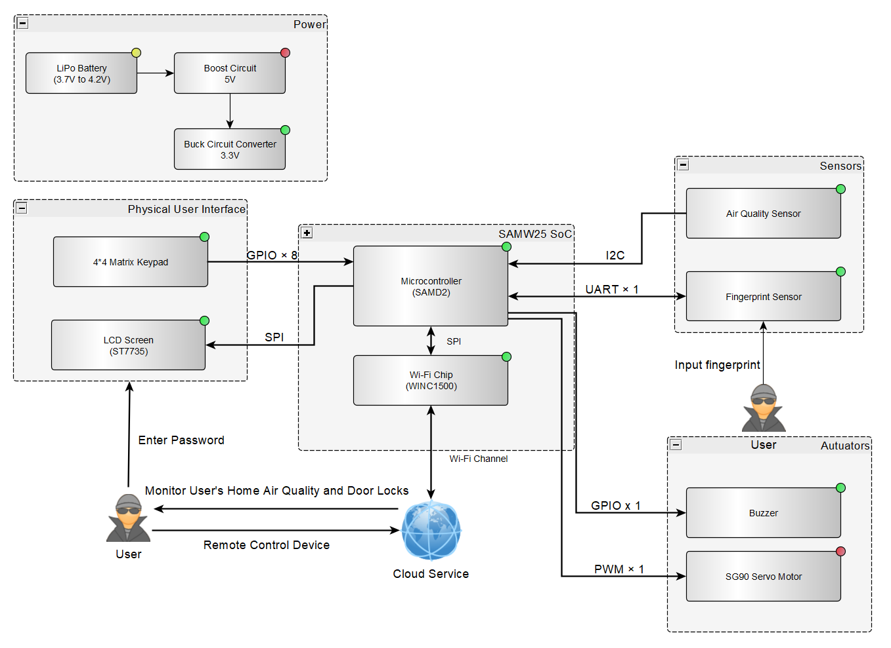
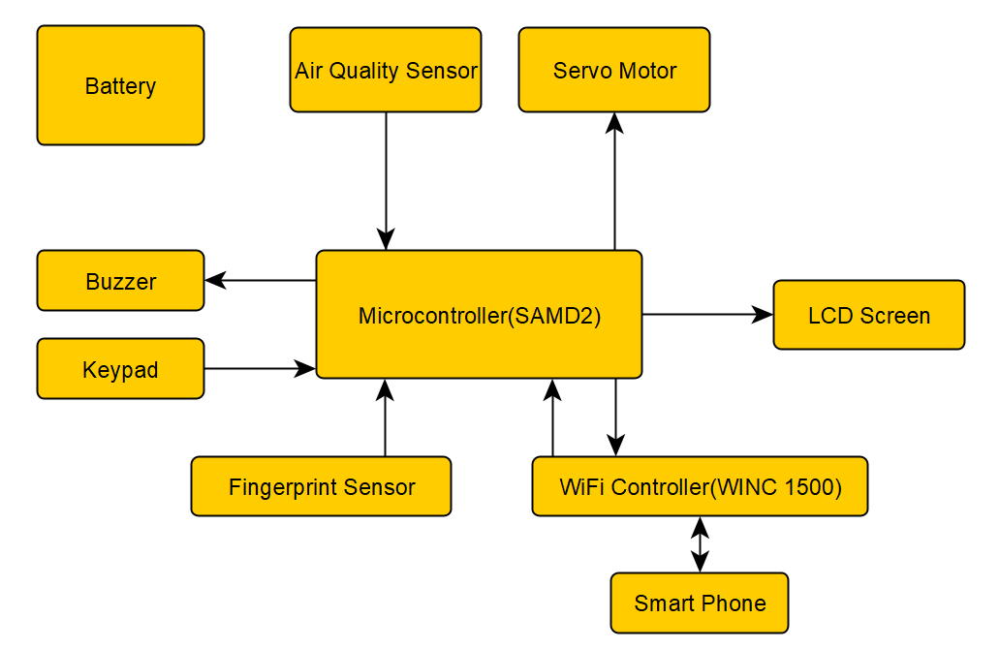

## 2.3 Challenges

### 2.3.1 3.3V Power Output Error

- Among the three hardware boards we received, two had faulty 3.3V power outputs, fluctuating between 1.9V and 2.7V, which caused the entire system to fail to operate.
- **Solution:** We used an external power supply machine to directly force 3.3V into the 3.3V rails, stabilizing the modules. Fortunately, one of the boards was able to output a correct 3.3V, and we ultimately based our final system on that board.

### 2.3.2 UART Pin Damage

- Although one board had a stable 3.3V output, its UART RX pin (used for communicating with the fingerprint sensor) was damaged, resulting in communication failure.
- **Solution:** We initially attempted to repurpose the UART line reserved for CLI debugging for fingerprint communication, but this made debugging extremely inconvenient. Ultimately, we introduced an additional Arduino board (which matched the fingerprint sensor’s Arduino library) and configured its TX pin as a GPIO. When a correct fingerprint was detected, the Arduino would output a high signal to the SAMW25; otherwise, it would hold a low signal until the fingerprint enrollment timed out.

### 2.3.3 Insufficient 5V Current Supply

- We discovered that the 5V power module provided insufficient current to drive the servo motor.
- **Solution:** Since we had already introduced an Arduino board, we used it to supply stable 5V power to the servo motor.

### 2.3.4 Insufficient Memory Resources

- Initially, we created a separate FreeRTOS task for each peripheral, which frequently led to memory allocation failures and stack overflows.
- **Solution:** We offloaded the fingerprint management task to the Arduino board, significantly reducing the SAMW25 MCU's memory pressure. We also continuously tuned the stack size of each remaining task, eventually achieving a balanced and stable memory allocation.

### 2.3.5 Slow LCD Character Rendering

- We noticed that the original LCD library rendered strings very slowly, severely affecting user experience.
- **Solution:** We optimized the string rendering logic by switching from character-by-character refresh to a streamed refresh mode, allowing full strings to appear instantly.

### 2.3.6 Coordinating Interactions Across Modules

- With multiple peripherals integrated into the device, efficiently managing their interactions under FreeRTOS was critical to ensuring system performance.
- **Solution:**

  - LCD Display Task and Air Quality Measurement Task communicate through a message queue that transmits pointers to structured data, enabling flexible real-time information display and environmental monitoring.

  - Buzzer and Servo Motor are controlled via task notifications; different notification commands trigger different operating modes.

  - Keypad Interaction is managed through a semaphore: when no key is pressed, the task remains blocked; when a key is pressed, the semaphore is released, triggering the execution of the corresponding function.

## 2.4 Prototype Learnings

- Lessons Learned:  
Through building and testing this prototype, We learned the importance of careful system integration. Even if individual modules (such as sensors, communication modules, and microcontrollers) work correctly in isolation, their interaction often reveals unforeseen challenges, such as timing issues, data synchronization problems, and power supply inconsistencies. We also gained experience with debugging network-related problems, especially when dealing with HTTP services and MQTT communication within a local network. Furthermore, We learned the value of iterative testing: making small, incremental changes and validating each step helped identify and fix errors efficiently.

- What We Would Do Differently:  
If We had to build this device again, We would plan a more modular architecture from the beginning, with clearly defined interfaces between hardware and software components. We would also spend more time early on designing the network communication structure, ensuring that server accessibility, IP management, and firewall settings are accounted for to avoid troubleshooting delays. Additionally, We would automate more of the testing procedures, particularly for OTA (Over-the-Air) updates, to streamline the development cycle and catch errors earlier.

## 2.5 Next Steps & Takeaways

### 2.5.1 What steps are needed to finish or improve this project?

Moving forward, we plan to further enhance the security of the system by storing passwords either in the cloud or on a local SD card, along with implementing CRC checks to prevent password resets caused by unexpected power losses. For cloud communication, we aim to transition from HTTP to HTTPS to ensure secure data transmission. Additionally, we plan to optimize the fingerprint authentication module by porting its driver to the SAMW25 microcontroller, thereby improving the overall system integration and reducing hardware complexity.

### 2.5.2 What did you learn in ESE5160 through the lectures, assignments, and this course-long prototyping project?

Through the lectures, assignments, and the semester-long prototyping project in ESE5160, we learned the complete end-to-end process of full-stack device development. This includes peripheral selection, product concept and system design, PCB schematic and layout creation, implementation of various communication protocols, utilization of real-time operating systems, and systematic PCB hardware testing. Moreover, this project significantly improved our proficiency in embedded software development and code organization.

## 2.6 Project Links

Github: [Final Project Code](https://github.com/ese5160/final-project-t11-keep-real)

Node-RED instance : [Node-RED](http://172.174.0.86:1880/ui/#!/0?socketid=I1rfjv0GBX7xcVSAAAAP)

PCBA : [Final PCBA](https://upenn-eselabs.365.altium.com/designs/D8D0336A-E253-4C95-9AC1-2877A2B9D09F?variant=[No+Variations]&activeDocumentId=Top20Level.SchDoc(1)&activeView=SCH&location=[1,97.57,18.1,21.98]#design)

# 3. Hardware & Software Requirements

## 3.1 Hardware Requirements

### 3.1.1 Overview

The project's hardware comprises a fingerprint sensor, a secure 4x4 matrix keypad for password input, and an SG90 servo motor for accurate lock simulation. The air quality sensor is used to detect data such as temperature, humidity, and air quality inside the house and display it on an LCD screen. A buzzer is used to trigger an alarm when necessary.

### 3.1.2 Definitions, Abbreviations

- ST7735: Single-chip controller/driver for 262K-color, graphic type TFT-LCD.
- 4x4 matrix keypad: Traditional input method. SG90: Servo motor controlled by PWM.
- BME680: Environmental Sensor that combines a gas sensor with temperature, humidity and barometric pressure sensing

### 3.1.3 Functionality

- HRS 01 – Microcontroller Core  
  The project will focus on the SAM W25 microcontroller, offering Wi-Fi connectivity and powerful data processing to manage sensor inputs and control output devices.  
  Interfaces include SPI, I2C, and UART, with an operating voltage of 3.3V.
- HRS 02 – Door Opening and Closing  
The system shall be capable of accurately controlling SG90's rotation angle via PWM signals to simulate the locking and unlocking of a door.  
Connection for SG90: PWM, Voltage: 5V
- HRS 03 – Password Input  
4x4 matrix keypad shall be used to get the password input. Connection for Keypad：GPIO*8
- HRS 04 – Air Quality Monitoring  
BME680 shall be able to measure air quality, temperature, humidity, and atmospheric pressure.  
Connection for BME680: I2C, Voltage: 3.3V
- HRS 05 – Fingerprint Detection  
The fingerprint sensor shall be capable of detecting the user's fingerprint input and performing fingerprint storage and comparison.  
Connection for Fingerprint Sensor: UART, Voltage: 3.3V
- HRS 06 - Data Display  
ST7735 shall be able to display air quality information and feedback from entered passwords.  
Connection for ST7735: SPI, Voltage: 3.3V
- HRS 07 - Buzzer Warning  
The buzzer shall alarm if the password or fingerprint is entered incorrectly too many times.  
Connection for ST7735: GPIO, Voltage: 3.3V

## 3.2 Software Requirements Specification (SRS)

### 3.2.1 Overview

The software is responsible for managing user input and controlling hardware behavior, including the storage, recognition, and comparison of fingerprints and passwords. If the number of incorrect inputs exceeds the limit, the system will generate an alarm and control the locking and unlocking of the door. Additionally, the software reads parameters from the air quality sensor, displays air quality information on the LCD screen, and finally uploads alarm messages and air quality data to the cloud. Users can also control the locking and unlocking of the door remotely via the cloud.

### 3.2.2 Users

Suitable for users with large households, who care about indoor air quality, and prefer not to carry keys when going out.

### 3.2.3 Definitions, Abbreviations

N/A

### 3.2.4 Functionality

- SRS 01 – Password Input  
When the user presses "1" on the keypad, the system shall enter password input mode. The user shall enter the stored password, and upon successful authentication, the system shall unlock the door by rotating the servo motor.

- SRS 02 – Fingerprint Recognition  
When the user presses "2" on the keypad, the system shall enter fingerprint recognition mode. The fingerprint sensor shall capture the user’s fingerprint and compare it against stored fingerprints for authentication. If matched, the system shall execute the door unlocking operation.

- SRS 03 – Password Modification  
When the user presses "3" on the keypad, the system shall enter password modification mode. After verifying the existing password, the user shall be allowed to input and save a new password into the system’s memory.

- SRS 04 – Fingerprint Enrollment  
When the user presses "4" on the keypad, the system shall enter fingerprint enrollment mode. The user shall be prompted to scan and store a new fingerprint, associating it with the current authentication database.

- SRS 05 – Fingerprint Deletion  
When the user presses "5" on the keypad, the system shall enter fingerprint deletion mode. The user shall be able to remove a previously stored fingerprint from the system's memory after successful verification.

- SRS 06 – Alarm Triggering and Cloud Notification  
If a user fails fingerprint or password authentication more than three consecutive times, the system shall trigger a buzzer alarm and send an alert notification to the cloud server.

- SRS 07 – Cloud-Based Unlocking  
The system shall support remote unlocking. When a valid unlock signal is received from the cloud server, the system shall unlock the door automatically.

- SRS 08 – Air Quality Detection and Cloud Upload  
The system shall measure indoor environmental parameters, including temperature, humidity, and air pressure, every 10 minutes. These measurements shall be uploaded to the cloud server via MQTT protocol.

- SRS 09 – LCD Information Display  
By default, the LCD screen shall display real-time indoor environmental data. During user interactions (such as password input, fingerprint enrollment, or modification processes), the screen shall dynamically update to display appropriate prompts to guide the user.

- SRS 10 – Virtual Keypad Functionality via Cloud  
The system shall provide a virtual keypad interface accessible via the cloud. The virtual keypad shall replicate the functionalities of the physical keypad, allowing users to perform actions such as password input, fingerprint enrollment, fingerprint deletion, and password modification remotely.

# 4. Project Photos & Screenshots

- Your final project, including any casework or interfacing elements that make up the full project (3D prints, screens, buttons, etc)

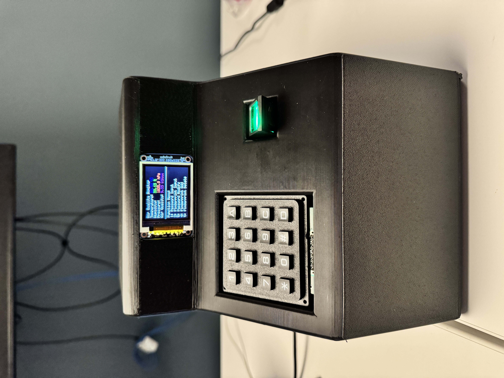
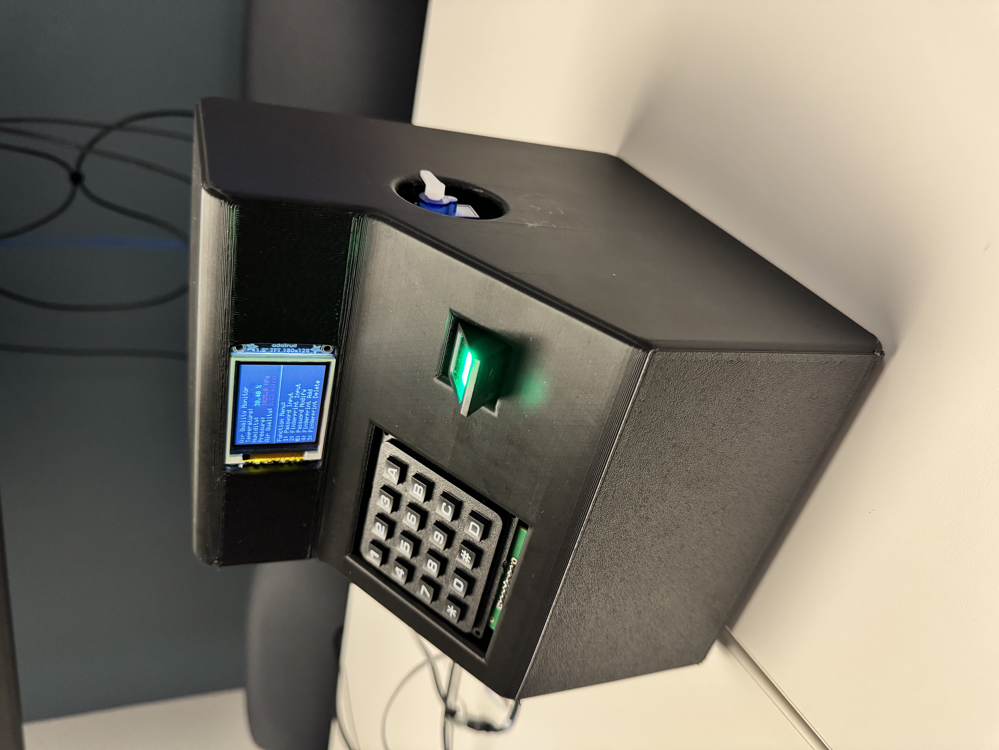
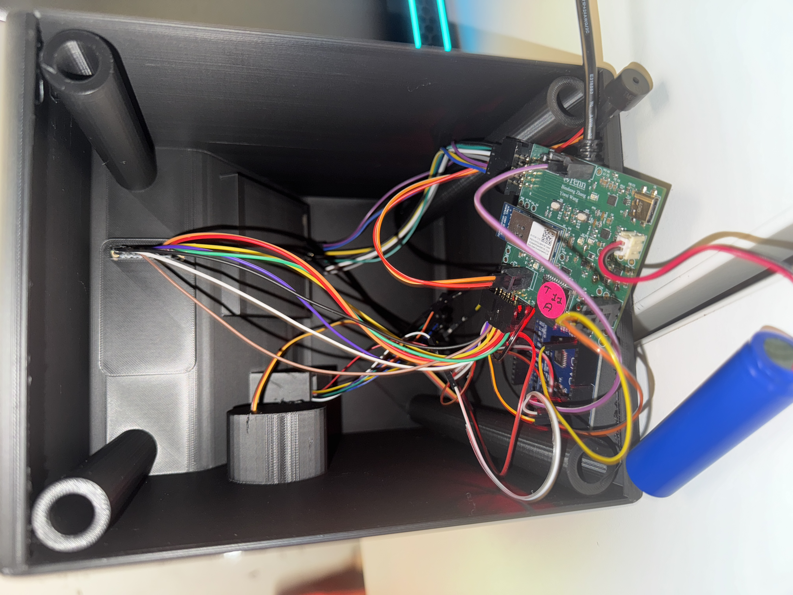

- The standalone PCBA, top
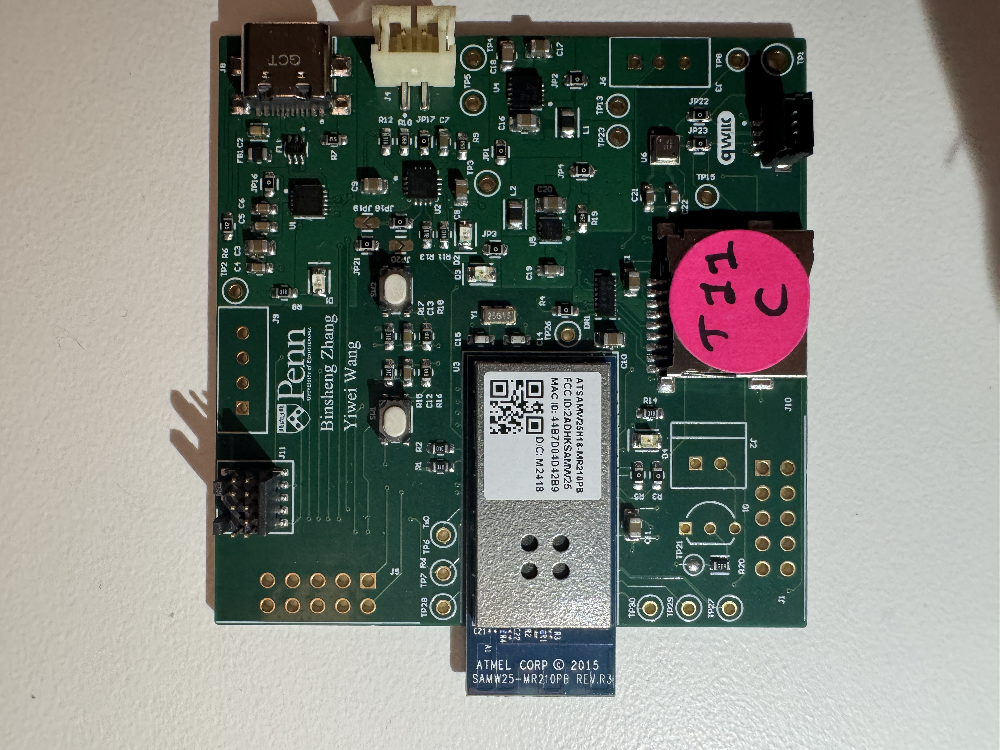
- The standalone PCBA, bottom
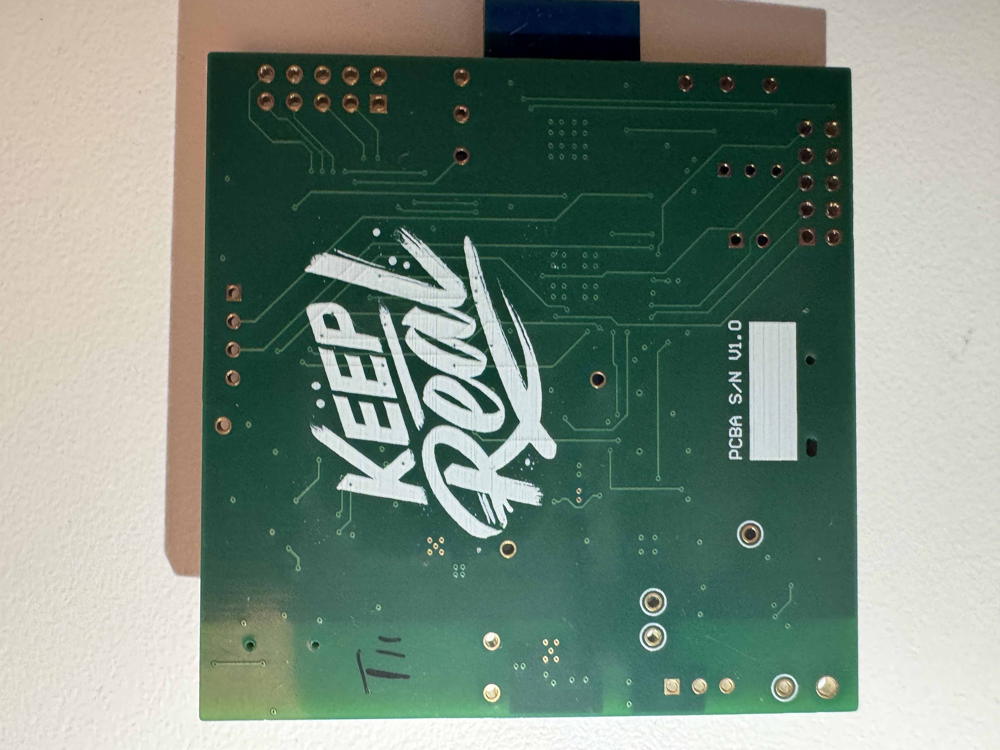
- Thermal camera images while the board is running under load (you may use your Board Bringup Thermal image here!)  
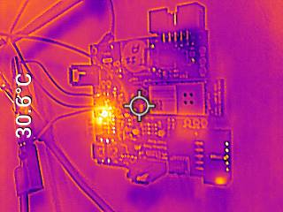
- The Altium Board design in 2D view (screenshot)
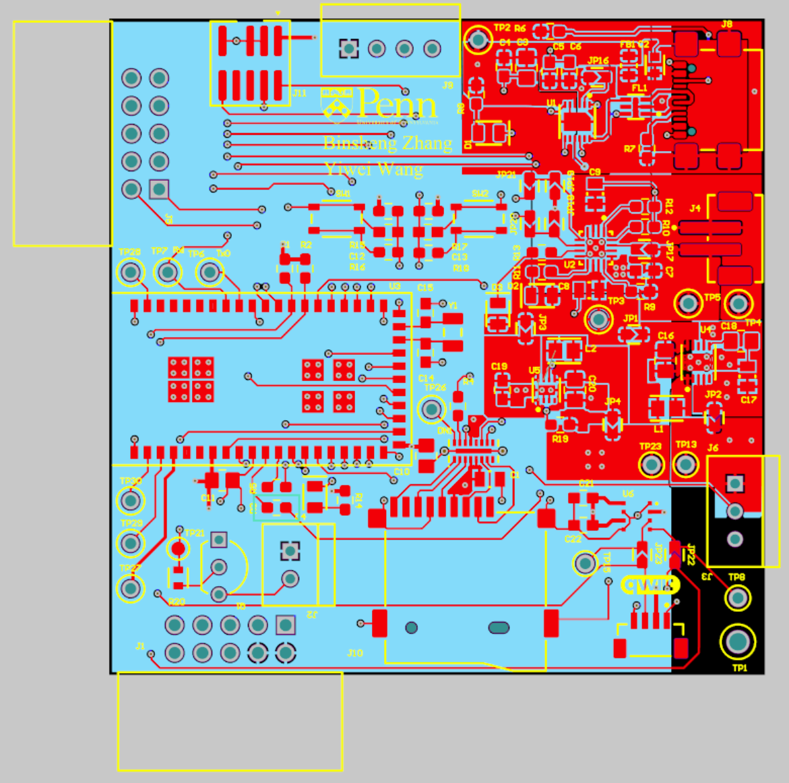
- The Altium Board design in 3D view (screenshot)
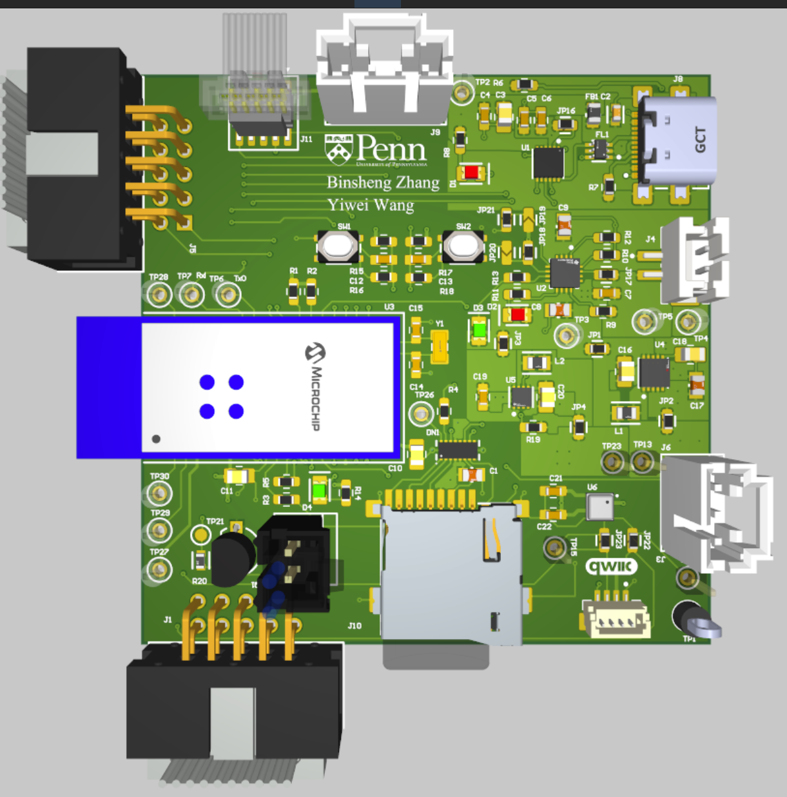
- Node-RED dashboard (screenshot)
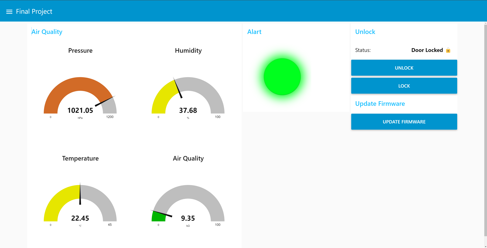
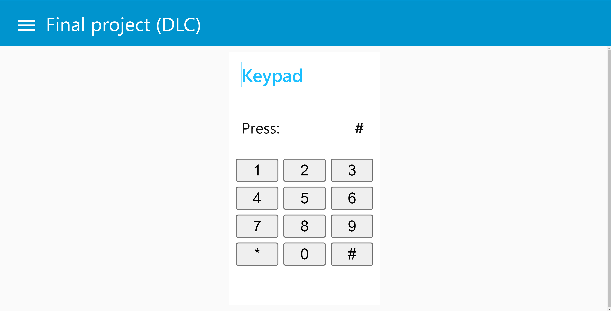
- Node-RED backend (screenshot)
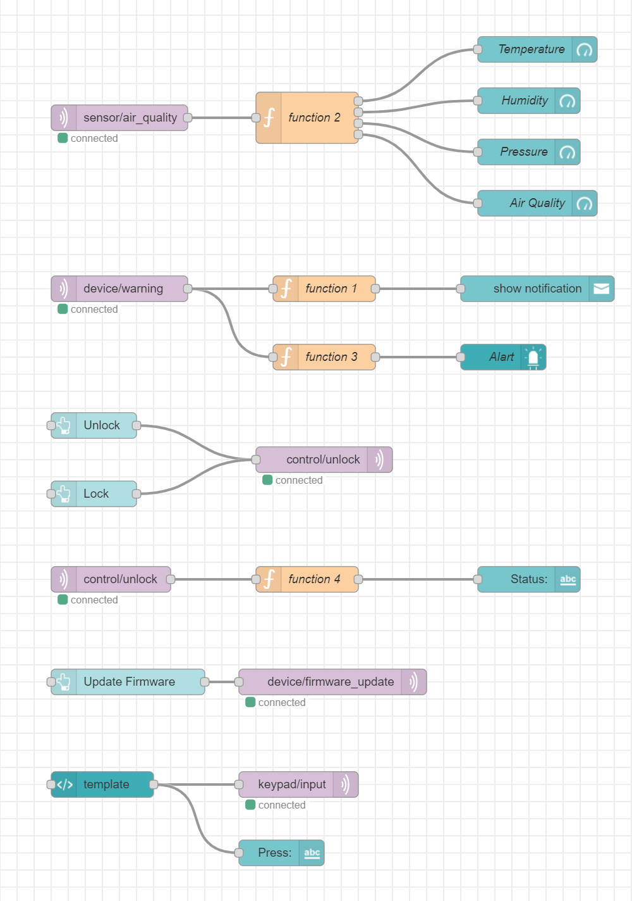
- Block diagram of your system (You may need to update this to reflect changes throughout the semester.)


# Third-Party Resources Used

- Adafruit BME680 Library (https://github.com/CaveMike/BME680_driver.git)  
- Fingerprint Sensor Library (https://github.com/libdriver/as608.git)(https://github.com/adafruit/Adafruit-Fingerprint-Sensor-Library.git)
